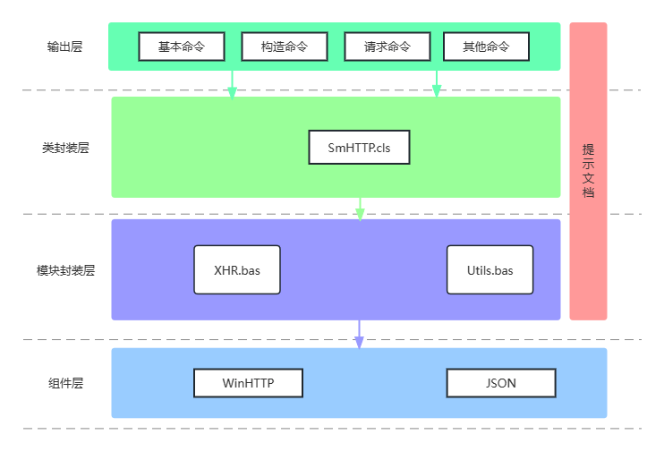

# SmHTTP.dll

神梦HTTP请求插件，用 VB6 开发的 ActiveX DLL 组件（COM+）

<!-- PROJECT SHIELDS -->
[![VB6][VB6-shield]][VB6-url]
[![WinHTTP][WinHTTP-shield]][WinHTTP-url]
[![JSON][JSON-shield]][JSON-url]
[![httpbin][httpbin-shield]][httpbin-url]
[![Anjian][anjian-shield]][anjian-url]

[![Contributors][contributors-shield]][contributors-url]
[![Forks][forks-shield]][forks-url]
[![Stargazers][stars-shield]][stars-url]
[![Issues][issues-shield]][issues-url]
[![MIT License][license-shield]][license-url]

<!-- PROJECT LOGO -->
<br />

<div style="text-align: center;">
  <a href="https://github.com/SMWHff/SmHTTP.dll/">
    
  </a>
  
  <h3>神梦HTTP请求插件</h3>
  <div style="text-align: left; display: inline-block;" width='100px'>
    ♦ 支持GET、POST、HEAD等HTTP协议请求<br>
    ♦ 支持构造请求协议头、请求Cookies<br>
    ♦ 支持构造各种类型请求体（url、form、json）<br>
    ♦ 支持解析JSON响应<br><br>
  </div>
  <p>希望这个插件能适用于开发者们的技术产品或服务与众不同的企业或个人。</p>
  <br />
  <a href="https://github.com/SMWHff/SmHTTP.dll/Documents/SmHTTP.html"><strong>探索本项目的文档 »</strong></a>
  <br />
  <br />
  <a href="https://github.com/SMWHff/SmHTTP.dll/Examples">查看Demo</a>
  ·
  <a href="https://github.com/SMWHff/SmHTTP.dll/issues">报告Bug</a>
  ·
  <a href="https://github.com/SMWHff/SmHTTP.dll/issues">提出新特性</a>
</div>


## 免责声明
> 1、本软件（指 'SmHTTP.dll' 插件）按 "原样" 提供，不带任何形式的明示或暗示保证，包括但不限于适销性、特定用途的适用性和非侵权性。在任何情况下，作者或版权持有者均不承担任何索赔、损害赔偿或其他责任，无论是在一个行动的合同、侵权行为或其他方面，从而产生、引起或与本软件的使用或其他交易有关。
> 2、使用者必须了解使用本软件进行网络请求可能受到各种法律法规和或第三方服务条款的约束，并且使用者应当自行确保其使用行为符合所有适用的法律和服务条款。作者或版权持有者不对因使用本软件而可能导致的任何形式的法律问题或损失承担责任。
> 3、使用本软件即表示您了解并同意此免责声明。如果您不同意上述条款，请不要使用本软件。

 
## 目录
- [上手指南](#上手指南)
  - [开发前的配置要求](#开发前的配置要求)
  - [安装步骤](#安装步骤)
- [文件目录说明](#文件目录说明)
- [开发的架构](#开发的架构)
- [部署](#部署)
- [使用到的框架](#使用到的框架)
- [贡献者](#贡献者)
  - [如何参与开源项目](#如何参与开源项目)
- [版本控制](#版本控制)
- [作者](#作者)
- [鸣谢](#鸣谢)

### 上手指南
1. 安装 <a href="https://pc.qq.com/detail/19/detail_91139.html" target="_blank">Visual Basic 6.0</a>
2. 双击 `神梦HTTP请求插件工程组.vbg` 打开项目工程  


#### 开发前的配置要求
1. 使用 Windows 操作系统
2. 安装 <a href="https://pc.qq.com/detail/19/detail_91139.html" target="_blank">Visual Basic 6.0</a>
3. 安装 <a href="http://www.anjian.com/" target="_blank">按键精灵2014</a>


#### **安装步骤**
1. Clone the repo
```sh
git clone https://github.com/SMWHff/SmHTTP.dll.git
```

### 调用例子
```
' 作者：神梦无痕
' ＱＱ：1042207232
' Ｑ群：624655641
'
' 先将 SmHTTP.dll 注册到系统
' 打开 CMD 窗口
' 输入：regsvr32 SmHTTP.dll

Set SmHTTP = CreateObject("SMWH.SmHTTP")

Dim user, pass, Data, Ret, Cookies, Headers

' 开启自动识别参数模式
Call SmHTTP.SetAutoParamArray(True)

user = "你的按键精灵论坛账号"
pass = "你的按键精灵论坛密码"


' 登录论坛账号
Data = SmHTTP.Data( _
    "username", user, _
    "password", pass, _
    "question", "0", _
    "answer", "", _
    "templateid", "0", _
    "login", "", _
    "expires", "43200" _
)
Ret = SmHTTP.HTTP_Request("POST", "http://bbs.anjian.com/login.aspx?referer=forumindex.aspx", Data)
' 判断是否登录成功
If InStr(Ret, user) = 0 Then  
    MsgBox "出错，登录失败！", 16 + 4096, "报错！"
    EndScript
End If
Cookies = SmHTTP.GetCookies()


' 打卡签到
Data = SmHTTP.Data( _
    "signmessage", "签个到，每天心情都是美美哒~~按键精灵祝大家新年好运连连！！" _
)
Headers = SmHTTP.Headers( _
    "Referer", "http://bbs.anjian.com/" _
)
Ret = SmHTTP.HTTP_Request("POST", "http://bbs.anjian.com/addsignin.aspx?infloat=1&inajax=1", Data, Headers, Cookies)
If InStr(Ret, "恭喜您获取本日签到奖励") Or InStr(Ret, "你今天已经签到过了") Then ' 判断是否签到成功
    MsgBox "恭喜，您已完成签到任务！", 64 + 4096, "温馨提示"
End If
```


### 文件目录说明
```
文件目录
├─Documents/
│  ├─Literature/
│  └─SmHTTP_chm/
│      ├─bin/
│      ├─css/
│      ├─html/
│      │  ├─其他命令/
│      │  ├─同步请求/
│      │  ├─基本命令/
│      │  ├─常见问题/
│      │  ├─异步请求/
│      │  └─构造命令/
│      └─js/
├─Examples/
│  ├─TC简单开发/
│  ├─VBScript/
│  └─按键精灵/
├─Project/
│  ├─bas/
│  ├─cls/
│  ├─res/
│  ├─TestCase/
│  ├─SmHTTP.vbp
│  └─TestSmHTTP.vbp
├─Releases/
├─LICENSE
├─README.md
└─神梦HTTP请求插件工程组.vbg
```


### 开发架构图



### 部署
暂无


### 使用到的框架
- <a href="https://learn.microsoft.com/zh-cn/windows/win32/winhttp/using-winhttp">WinHTTP</a>
- <a href="https://www.json.org/json-zh.html">JSON</a>


### 贡献者
请阅读**CONTRIBUTING.md** 查阅为该项目做出贡献的开发者。


#### 如何参与开源项目
贡献使开源社区成为一个学习、激励和创造的绝佳场所。你所作的任何贡献都是**非常感谢**的。
1. `Fork` 当前项目
2. 创建你自己的分支 (`git checkout -b feature/AmazingFeature`)
3. 提交修改内容 (`git commit -m 'Add some AmazingFeature'`)
4. 上传到远程仓库 (`git push origin feature/AmazingFeature`)
5. 打开一个拉取请求


### 版本控制
该项目使用Git进行版本管理。您可以在repository参看当前可用版本。


### 作者
【昵称】：[![神梦无痕][SMWHff-shield]][SMWHff-url]</br>
【ＱＱ】：[![1042207232][QQ-shield]][QQ-url]</br>
【Ｑ群】：[![624655641][QQun-shield]][QQun-url]</br>
【邮箱】：[![1042207232@qq.com][QEmail-shield]][QEmail-url]</br>

*您也可以在贡献者名单中参看所有参与该项目的开发者。*


### 版权说明
该项目签署了 BSD 授权许可，详情请参阅 [LICENSE](https://github.com/SMWHff/SmHTTP.dll/blob/master/LICENSE)


### 鸣谢
- [GitHub Pages](https://pages.github.com)
- [GitHub Best_README_template](https://github.com/shaojintian/Best_README_template)
- [Choose an Open Source License](https://choosealicense.com)
- [Img Shields](https://shields.io)
- [JSON.org](https://www.json.org/)
- [按键精灵](https://www.anjian.com/)


<!-- links -->
[your-project-path]:SMWHff/SmHTTP.dll
[contributors-shield]: https://img.shields.io/github/contributors/SMWHff/SmHTTP.dll.svg?style=flat-square
[contributors-url]: https://github.com/SMWHff/SmHTTP.dll/graphs/contributors
[forks-shield]: https://img.shields.io/github/forks/SMWHff/SmHTTP.dll.svg?style=flat-square
[forks-url]: https://github.com/SMWHff/SmHTTP.dll/network/members
[stars-shield]: https://img.shields.io/github/stars/SMWHff/SmHTTP.dll.svg?style=flat-square
[stars-url]: https://github.com/SMWHff/SmHTTP.dll/stargazers
[issues-shield]: https://img.shields.io/github/issues/SMWHff/SmHTTP.dll.svg?style=flat-square
[issues-url]: https://img.shields.io/github/issues/SMWHff/SmHTTP.dll.svg
[license-shield]: https://img.shields.io/github/license/SMWHff/SmHTTP.dll.svg?style=flat-square
[license-url]: https://github.com/SMWHff/SmHTTP.dll/blob/master/LICENSE.txt
[linkedin-shield]: https://img.shields.io/badge/-LinkedIn-black.svg?style=flat-square&logo=linkedin&colorB=555
[linkedin-url]: https://linkedin.com/in/SMWHff
[Win-shield]: https://img.shields.io/badge/OS-Windows-blue
[VB6-shield]: https://img.shields.io/badge/Visual%20Basic-6.0-blue?labelColor=512BD4
[VB6-url]: https://pc.qq.com/detail/19/detail_91139.html
[anjian-shield]: https://img.shields.io/badge/%E6%8C%89%E9%94%AE%E7%B2%BE%E7%81%B5-2014-white?logoColor=24ab5e&labelColor=24ab5e
[anjian-url]: http://www.anjian.com/
[WinHTTP-shield]: https://img.shields.io/badge/WinHTTP-5.1-blue
[WinHTTP-url]: https://learn.microsoft.com/zh-cn/windows/win32/winhttp/using-winhttp
[JSON-shield]: https://img.shields.io/badge/JSON-2009.4-blue
[JSON-url]: http://www.ediy.co.nz/vbjson-json-parser-library-in-vb6-xidc55680.html
[httpbin-shield]: https://img.shields.io/badge/httpbin.org-0.9.2-blue
[httpbin-url]: https://httpbin.org/
[SMWHff-shield]: https://img.shields.io/badge/%E6%98%B5%E7%A7%B0-%E7%A5%9E%E6%A2%A6%E6%97%A0%E7%97%95-8A2BE2
[SMWHff-url]: https://smwhff.com
[QQ-shield]: https://img.shields.io/badge/QQ-1042207232-blue?logo=tencentqq&logoColor=EB1923
[QQ-url]: http://wpa.qq.com/msgrd?v=3&uin=1042207232&site=qq&menu=yes
[QQun-shield]: https://img.shields.io/badge/Q%E7%BE%A4-624655641-blue?logo=tencentqq&logoColor=4DC9FC
[QQun-url]: https://qm.qq.com/cgi-bin/qm/qr?k=gIac3vFLxvho5YxrAmA1gZwsbMZ_xKky&jump_from=webapi&authKey=vSW162lX1N9zVYQOKNtGHdV//ZPZsRSb7TyRMktB0V4ofuy3LiuAwEFsRf8P7RXS
[QEmail-shield]: https://img.shields.io/badge/Email-1042207232%40qq.com-blue?logo=gmail&logoColor=white
[QEmail-url]: http://mail.qq.com/cgi-bin/qm_share?t=qm_mailme&email=0uPi5uDg4uXg4eCSo6P8sb2-